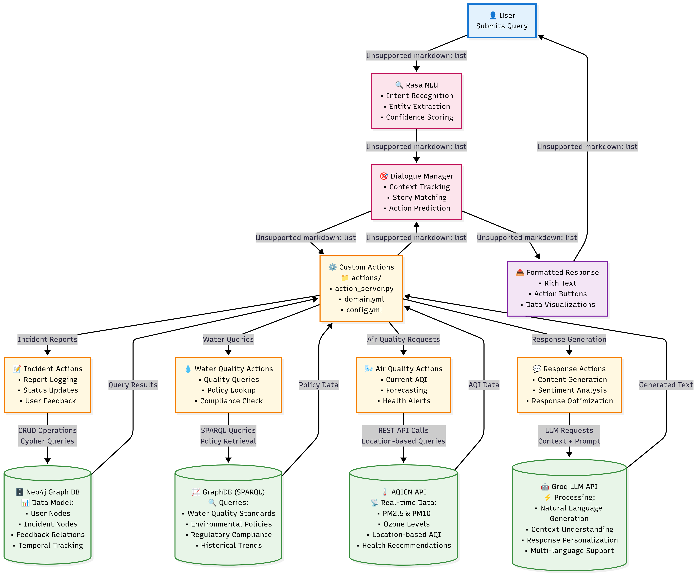
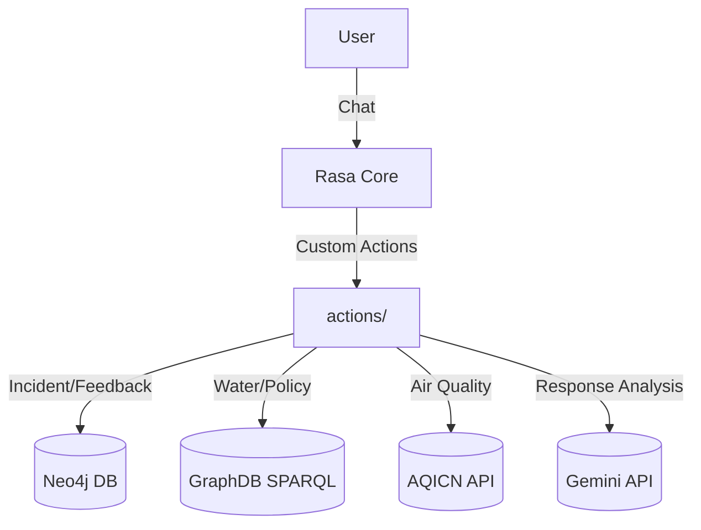
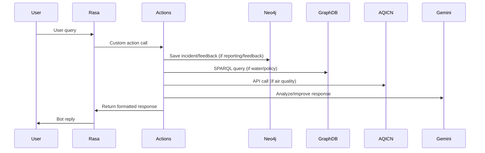

# Environmental Data Chatbot Backend

## Overview
This project is a backend for an advanced environmental data chatbot built with Rasa. It integrates multiple data sources and technologies to provide users with:
- **Incident reporting** (Neo4j)
- **Water quality queries** (GraphDB/SPARQL)
- **Policy queries** (GraphDB/SPARQL)
- **Air quality queries** (AQICN API)
- **Feedback collection** (Neo4j)
- **Response analysis and improvement** (Gemini API)

---

## Architecture Diagram

### Block-Level Architecture



### Detailed Data Flow



---

## File-by-File Explanation

### 1. `actions/air_quality.py`
- Handles air quality queries using AQICN API.
- Geocodes city/location using geopy/Nominatim.
- Fetches AQI and pollutant data, formats response with emojis.
- Handles errors and fallback to city name search.

### 2. `actions/actions.py`
- Implements incident reporting form (slot filling, validation).
- Saves incident reports to Neo4j with unique IDs.
- Handles form activation, deactivation, and exit.
- Validates user input for each slot (name, contact, etc.).

### 3. `actions/feedback.py`
- Stores user feedback (thumbs up/down) in Neo4j.
- Handles feedback description for negative feedback.
- Stores last user query and bot response for context.

### 4. `actions/graphdb_client.py`
- Handles water quality and policy queries using SPARQLWrapper.
- Extracts city/municipality from user message.
- Builds and executes SPARQL queries for:
  - Water quality (by city, river, station)
  - Policy data (Spanish cities)
- Formats results for chatbot display.

### 5. `actions/response_analyzer.py`
- Uses Gemini API to analyze and improve bot responses.
- Checks grammar, structure, accuracy, formatting, completeness.
- Adds emojis and bullet points for readability.
- Detects city context from station IDs via GraphDB.

---

## Data Flow



---

## Key Technologies
- **Rasa**: Conversational AI framework
- **Neo4j**: Graph database for incident/feedback storage
- **GraphDB**: RDF triple store for water/policy data (SPARQL queries)
- **SPARQLWrapper**: Python library for SPARQL queries
- **AQICN API**: Real-time air quality data
- **geopy**: Geocoding for location/city extraction
- **Gemini API**: LLM-based response improvement

---

## How Each Component Works

### Incident Reporting (Neo4j)
- User fills a form (slots: incident_type, user_name, contact_number, etc.)
- Data validated and saved to Neo4j as a node with timestamp and unique ID.
- User receives confirmation and summary.

### Water Quality Queries (GraphDB/SPARQL)
- User asks for water data ("Show water quality for Madrid")
- City/municipality extracted from message.
- SPARQL query built and sent to GraphDB.
- Results formatted (physical/chemical/other parameters, years, locations).

### Policy Queries (GraphDB/SPARQL)
- User asks for policies ("Policy for Madrid")
- City extracted and checked against supported list.
- SPARQL query built for comprehensive or waste-focused policies.
- Results formatted (regulations, waste schedules, emission standards, etc.).

### Air Quality Queries (AQICN API)
- User asks for air quality ("AQI in Paris")
- City/location geocoded to lat/lon.
- AQICN API called for AQI and pollutants.
- Results formatted with emojis and levels.

### Feedback Collection (Neo4j)
- User gives thumbs up/down.
- Feedback saved to Neo4j with context (query, response, description).

### Response Analysis (Gemini API)
- After each bot response, Gemini API analyzes and improves reply.
- Checks grammar, formatting, completeness, adds emojis.
- Enhanced response sent to user if significantly improved.

---

## Configuration Files
- `config.yml`: Rasa pipeline and policies (Spacy, DIET, Fallback, etc.)
- `domain.yml`: Intents, entities, slots, forms, responses, actions
- `endpoints.yml`: Action server, GraphDB endpoints, Neo4j credentials
- `credentials.yml`: Rasa REST and other channel credentials
- `data/nlu.yml`: Training data for intents/entities
- `data/rules.yml`: Conversation rules (form, queries, feedback)
- `data/stories.yml`: Example stories for feedback and queries

---

## Environment Variables
- Set Neo4j credentials in `endpoints.yml` or as environment variables:
  - `NEO4J_URI=bolt://localhost:7687`
  - `NEO4J_USER=neo4j`
  - `NEO4J_PASSWORD=your_password`
- GraphDB endpoints:
  - `WATERBASE_SPARQL=http://localhost:7200/repositories/waterbase`
  - `POLICY_SPARQL=http://localhost:7200/repositories/policy`
- Gemini API key: Set in `endpoints.yml` or as env variable

---

## Running the Project
1. **Install dependencies:**
   ```bash
   pip install -r requirements.txt
   ```
2. **Start Neo4j and GraphDB servers.**
3. **Run Rasa action server:**
   ```bash
   rasa run actions
   ```
4. **Run Rasa server:**
   ```bash
   rasa run
   ```
5. **Interact via REST or Rasa X.**

---

## Visuals & Examples

### Incident Report Example
```
User: I want to report illegal dumping
Bot: What incident do you want to report?
User: Illegal dumping
Bot: What is your name?
User: John Doe
... (form continues)
Bot: ✅ Thank you! Your incident report has been successfully submitted.
```

### Water Quality Query Example
```
User: Show water quality for Madrid
Bot: 🌊 Water Quality Data for Madrid:
  • pH: 7.2
  • Nitrate: 2.1 mg/L
  ...
```

### Policy Query Example
```
User: Policy for Madrid
Bot: 🏛️ Environmental Policies for Madrid:
  • Waste Collection: Monday, Thursday
  • Emission Standard: Euro 6
  ...
```

### Air Quality Query Example
```
User: AQI in Paris
Bot: 🌍 Air Quality near Paris:
  • AQI: 42 (Good)
  • PM2.5: 12 µg/m³
  ...
```

### Feedback Example
```
User: 👍
Bot: Thanks for the positive feedback! It helps us improve.
User: 👎
Bot: Sorry to hear that. Please briefly describe what went wrong.
User: Too slow
Bot: Feedback noted: 'Too slow'. Thanks for helping us improve!
```

---

## Contributing
- Fork the repo, create a branch, submit PRs.
- For SPARQL schema changes, update queries in `actions/graphdb_client.py`.
- For Neo4j changes, update connection and node creation logic in `actions.py` and `feedback.py`.

---

## Contact
2125bcse18@uithpu.ac.in

---

## Further Reading
- [Rasa Documentation](https://rasa.com/docs/)
- [Neo4j Documentation](https://neo4j.com/docs/)
- [GraphDB Documentation](https://graphdb.ontotext.com/documentation/)
- [AQICN API](https://aqicn.org/api/)
- [Gemini API](https://Gemini.com/)
